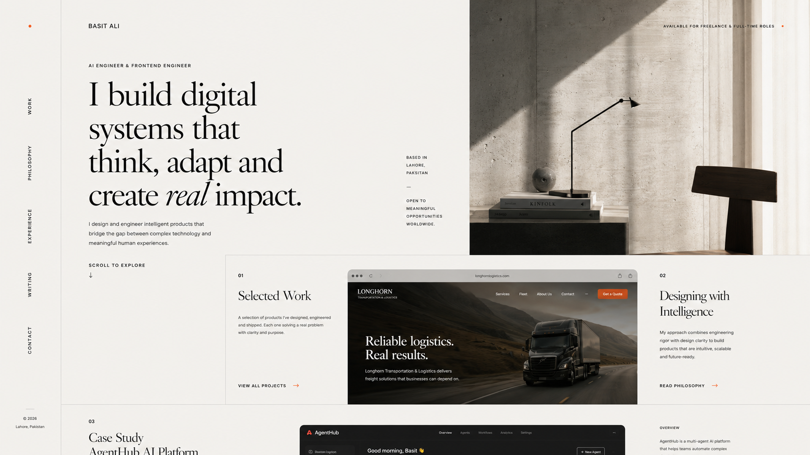

# Basit Ali — Portfolio

An editorial portfolio for **Basit Ali**, an AI engineer, full-stack developer, and graphic designer based in Karachi, Pakistan. The site presents selected production websites, interactive tools, experience, design philosophy, and contact details in a responsive light/dark interface.



## Highlights

- Responsive layouts for mobile, tablet, and desktop
- Light and dark themes with saved user preference
- Scroll-responsive `BASIT ALI` → `BA` animated wordmark
- Curated live-project gallery with real website screenshots
- Dedicated philosophy, experience, and writing routes
- Accessible mobile navigation and keyboard focus states
- Reduced-motion support
- Floating, footer-aware WhatsApp contact action
- Optimized responsive images and production-ready metadata

## Tech Stack

- [Next.js](https://nextjs.org/) 16
- [React](https://react.dev/) 19
- [TypeScript](https://www.typescriptlang.org/)
- [Tailwind CSS](https://tailwindcss.com/) 4
- [Framer Motion](https://motion.dev/)
- [GSAP](https://gsap.com/)
- [Three.js](https://threejs.org/) with React Three Fiber

## Getting Started

### Prerequisites

- Node.js 20 or newer
- npm

### Installation

```bash
git clone https://github.com/Basit1478/<repository-name>.git
cd <repository-name>
npm install
npm run dev
```

Open [http://localhost:3000](http://localhost:3000) in your browser.

No environment variables are required for the current portfolio.

## Available Commands

| Command | Purpose |
| --- | --- |
| `npm run dev` | Start the local development server |
| `npm run build` | Create an optimized production build |
| `npm run start` | Run the production build locally |
| `npm run lint` | Run TypeScript validation |

## Routes

| Route | Content |
| --- | --- |
| `/` | Portfolio, live projects, approach, about, and contact |
| `/experience` | Experience and capabilities |
| `/philosophy` | Working principles and design philosophy |
| `/writing` | Writing and field notes |
| `/work` | Redirects to the homepage live-project section |
| `/contact` | Redirects to the homepage contact section |

## Featured Work

The portfolio includes live previews and screenshots for projects such as:

- Acmeem
- Blazon 360
- Ali Rent a Car
- Infology
- PRD Generator
- Avion
- Personal Library Manager
- Secure Data Encryption
- Password Strength Meter
- QR Code Generator
- Unit Converter
- Growth Mindset Challenge
- Interactive Python games and utilities

## Deployment

Create and verify a production build locally:

```bash
npm run build
npm run start
```

The project can be deployed to Vercel directly or connected to a GitHub repository. Vercel will automatically detect the Next.js framework and use the existing build script.

## Contact

- Email: [ba876943@gmail.com](mailto:ba876943@gmail.com)
- GitHub: [Basit1478](https://github.com/Basit1478)
- LinkedIn: [Basit Ali](https://www.linkedin.com/in/basit-ali-baloch-738285253/)
- WhatsApp: [+92 370 3168969](https://wa.me/923703168969)

---

Designed and developed by **Basit Ali**.
